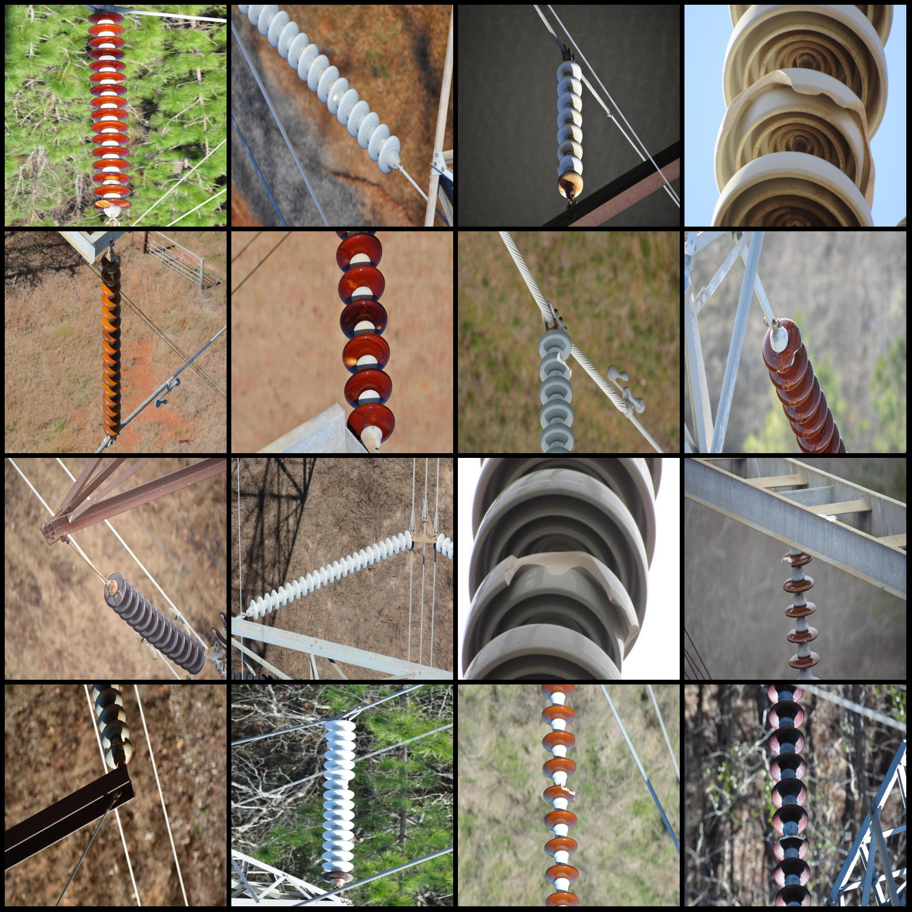
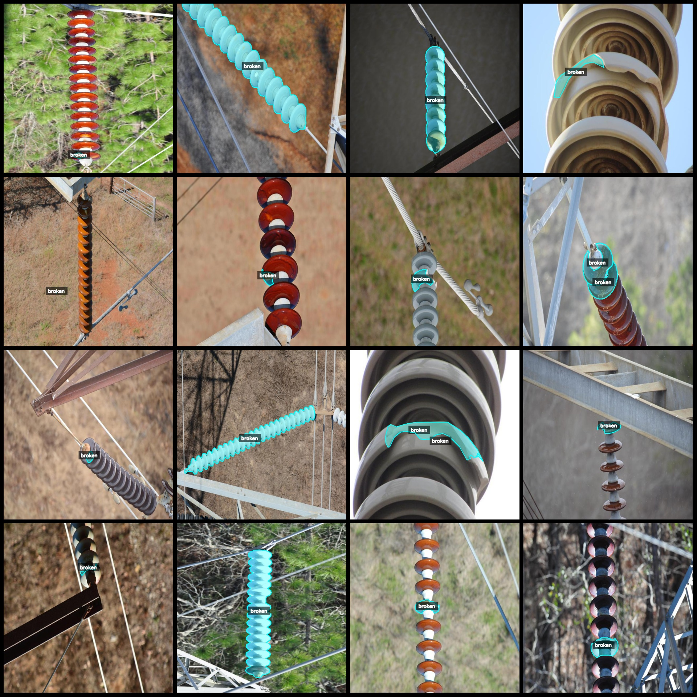
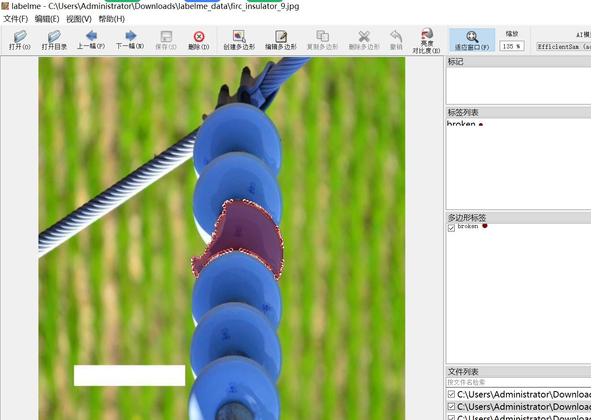

# Power Grid Insulator Fragility Identification and Segmentation Dataset in LabelMe Format with 1700 Images per Category

Dataset format: labelme format (excluding mask files, only containing jpg images and corresponding json files)  
Number of images (number of jpg files): 1700  
Number of annotations (json file count): 1700  
Number of annotation categories: 1  
Annotation category name: ["broken"]  
Number of boxes for each category:  
Broken count = 2535  
Total number of boxes: 2535  
Labelme tool used: labelme=5.5.0  
Image resolution: 640x640  
Annotation rules: Polygons are drawn around the categories  
Important note: The dataset can be edited using labelme, but the json dataset needs to be converted into mask or yolo format or coco format for semantic segmentation or instance segmentation.  
Special declaration: This dataset does not guarantee the accuracy of the trained model or weight files.  
Preview of images:  
Example of annotation:  
Annotation drawing result:  
Labelme editing image example:
## Images

Here is a pay link on Stripe ( https://buy.stripe.com/3cs8yP7sY87d0vu9AB ). Please contact me lonlonago@foxmail.com after funding $89, and I will send you a complete data files , thank you!

